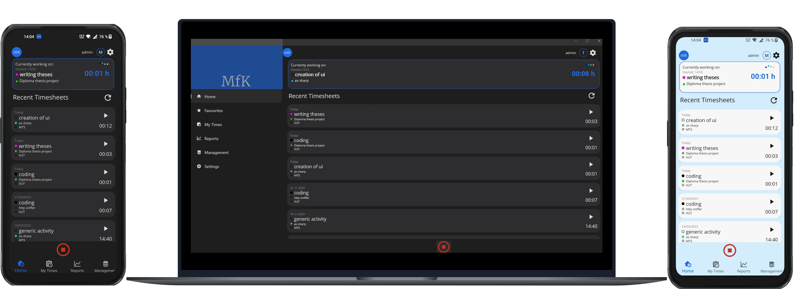

# MAUI for Kimai

<!-- images -->

MAUI for Kimai is multi-platform time-tracking app companion for open-source  [Kimai time-tracker](https://github.com/kimai/kimai). This application is fully focused on time-tracking use-case and aims to simplify time-tracking within Kimai.

Basic demonstration video: https://youtu.be/daTTTE8QJ0o

| Platform      | Supported       |
|--------------|----------------- |
| Android      | yes              |
| Windows      | yes              |
| iOS          | ? (need testing) |
| MacCatalyst  | ? (need testing) |

I don't have access to Mac build tools, therefore IOS/MacOS is untested, but in theory it should work (I tried to use platform-specific code as little as possible). If anyone have Mac available and would be willing to test it, please contact me, I would deeply appreciate it.

## Features

### Kimai features

- Timesheet management (start, stop, delete, recent, all)
- Favourites timesheets
    - set timesheet as favourite and store it in local database
- Timesheet quick start
- Reports and graphs for activities, projects, customers
    - today, this week, this month
- Multiple Kimai servers support
- Possibility to set default server for automatic sign-in
- Multiple Kimai users support
- Role based time-tracking
    - possibility to show timesheet entries based on user role
- Integration with Gitlab Kimai plugin [GitLabBundle](https://github.com/LibreCodeCoop/GitLabBundle)

### MAUI application features
- Dark/Light mode 
- Running timesheet notification (Android, iOS)
- Form validation with [Fluent validation](https://github.com/FluentValidation/FluentValidation)
- MySQL local database, Secure storage for API passwords
- Graphs by [LiveCharts2](https://github.com/beto-rodriguez/LiveCharts2)

## Limitations

- **Kimai v2 is not supported yet**
- There are some inconsistencies within in app dark/light theme changing
- There may be unexpected behaviour in iOS notifications (need testing)
- Missing management possibilities of users, customers, projects, teams
- Missing team reports
- Missing support offline time-tracking

## Installation

Since this is early release, only raw files are available. When time comes, there is a plan to publish apps in Google play and Microsoft store.

### Android

1. Download and manually install `signed apk` file from Github release.

### Windows
1. Download `.msix` file from Github release.

2. Follow installation instructions from [here](https://learn.microsoft.com/en-us/dotnet/maui/windows/deployment/publish-cli?view=net-maui-7.0#installing-the-app).

## What is next 

There is following plan to add features:
- Add integration within the team (team management, team reports)
- Add support for Kimai v2 API interface
- Add support for basic user management
- Add possibility to offline time-tracking and synchronize time-tracked timesheets when online again

## Contribution 
Feel free to share your ideas and create issues. PR's are welcome. I would really appreciate your feedback and ideas for improvements of UI or features.

## License 
This project is licensed under the MIT License - see the LICENSE file for more.

 

MAUI for Kimai

Contact: david.spavor@gmail.com